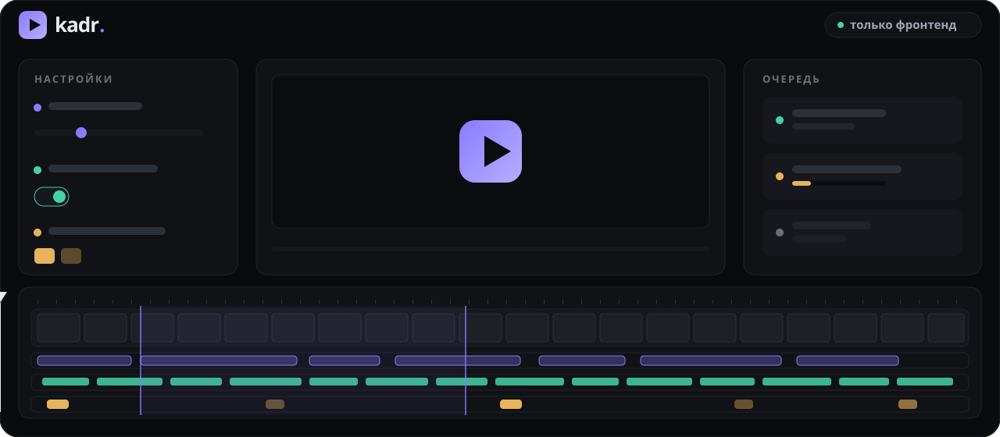

**Привет! Я H0seen — делаю фронтенд и визуальные инструменты.**

Тёмный минимализм: чистый интерфейс, продуманная типографика, ноль лишнего.

## ✦ Проект: kadr.

**kadr.** — студия коротких видео: загрузил MP4 → настроил нарезку, субтитры
и водяной знак прямо на таймлайне → задание уходит на сервер. Филмстрип
строится из реальных кадров видео, всё считается в браузере.

`vanilla js` · `zero build` · `dark ui` · `Nunito` · `Phosphor`

## ✦ Ещё

- **[VAltAuth](https://github.com/h0se3n/VAltAuth)** — эксперименты с аутентификацией.

## ✦ Принципы

- **Тёмный минимализм** — фон `#0A0B0D`, акцент `#8A7BFF`, ничего кричащего.
- **Ноль сборки** — браузер умеет всё нужное, бандлер не обязателен.
- **Живой интерфейс** — каждое действие отвечает превью, а не диалогом.

## ✦ Стек

## ✦ Змейка

---

`· · ──────── ✦ ──────── · ·`

**h0se3n** — тёмный минимализм, ванильный JS и немного магии

